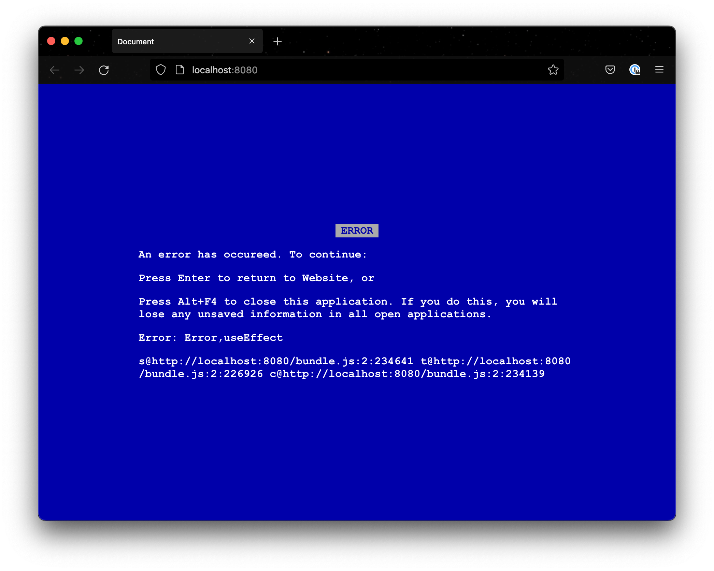

# React-bluescren

This library displays a blue screen when an error occurs in React.



## Demo

[https://trkbt10.github.io/react-bluescreen/](https://trkbt10.github.io/react-bluescreen/)

## Usage

```jsx
import { ErrorBoundary } from "react-bluescreen";

export const App: React.FC<React.PropsWithChildren<{}>> = ({ children }) => {
  return <ErrorBoundary variant="windows9x">{children}</ErrorBoundary>;
};
```

### Install

```bash
npm install git@github.com:trkbt10/react-bluescreen.git
```
